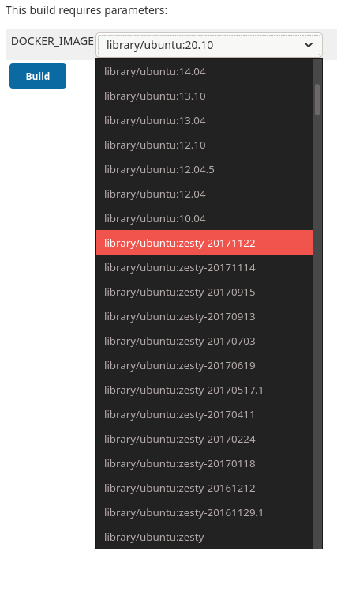
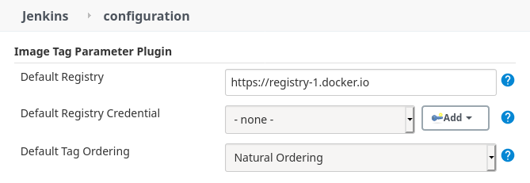

# Image Tag Parameter Plugin


[Changelog](CHANGELOG.md)

## Introduction
This plugin allows you to define (container) image tags as parameter in your builds.  
It uses the Docker **Registry HTTP API V2** to list tags available for an image.

## Screenshots






## Usage

### Definition in Freestyle / Pipeline UI
This is basically showcased in the above [screenshots](#screenshots) :wink:

### Definition in Pipeline
```groovy
pipeline {
  agent any

  parameters {
    imageTag credentialId: '', description: '', filter: 'lts.*', image: 'jenkins/jenkins', name: 'DOCKER_IMAGE', registry: 'https://registry-1.docker.io'
  }

  stages {
    stage('Test') {
      steps {
        echo "$DOCKER_IMAGE"
      }
    }
  }
}
```

**Required Values (Minimal Definition)**
```groovy
parameters {
  imageTag(name: 'DOCKER_IMAGE', image: 'jenkins/jenkins')
}
``` 

### Global Configuration

This Plugin allows a Jenkins admin to set a default registry in the Jenkins config, which will get used for any ImageTag parameter that does not overwrite the `registry` value in the parameter definition.
It is also possible (as of v1.7) to define a default credential, which should get used alongside of that default registry.
The default credential can be overwritten on a per parameter level just like the default registry.

#### JCasC (Jenkins Configuration as Code)

```yaml
unclassified:
# ...
  imageTagParameterConfiguration:
    defaultRegistry: https://registry-1.docker.io
    defaultCredentialId: ""
# ... 
```

Configuring this plugins global config was available via JCasC since the addition of the global config in v1.2,
but the `defaultCredentialId` value can only be configured with a ImageTagParam version equal or newer to v1.7.

### Exposed Environment Variables (and params, since version 1.6) 
Based on default Jenkins behaviour you can use `params.imageTagParameterName` to access the value of `imageName:imageTag`,
but since you most of the time only need the image tag by itself the plugin also exports some additional environment variables.

* **$imageTagParameterName_TAG** (or *env.imageTagParameterName_TAG*) contains only the tag value without the image name
* **$imageTagParameterName_IMAGE** (or *env.imageTagParameterName_IMAGE*) contains only the name of the image without the tag

## Contributing

Build instructions and requirements can be found in the [CONTRIBUTING](CONTRIBUTING.md) Markdown.
